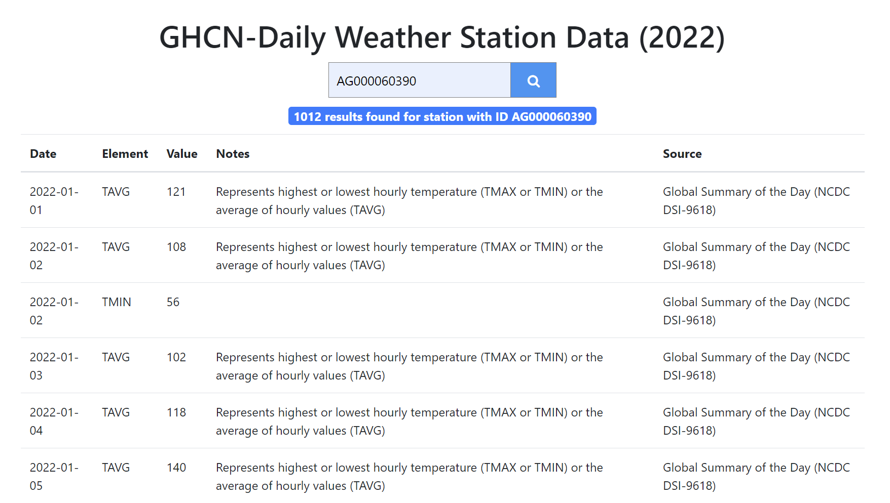

# noaa-api

REST API for retrieving info about weather stations using station ID.

The data is sourced from here:

ftp://ftp.ncdc.noaa.gov/pub/data/ghcn/daily/by_year/2022.csv.gz
ftp://ftp.ncdc.noaa.gov/pub/data/ghcn/daily/readme.txt

Run `node index.js` and visit `localhost:3000` to use the UI or `/station/<station_id>` to get the raw JSON response.
